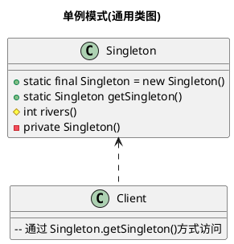
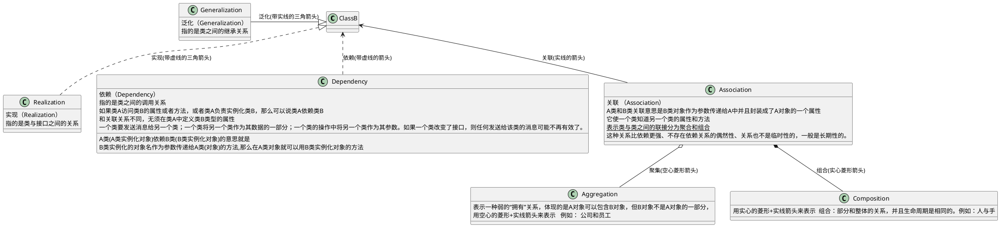
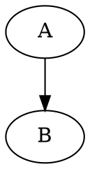

# 绘制流程图


> We're living the future so

# This is an < > tag
## This is an < h2 > tag
###### This is an < h6 > tag

# 这个标题拥有 1 个 id {#my_id}
# 这个标题有 2 个 classes {.class1 .class2}
1. Item 1
1. Item 2
1. Item 3
   1. Item 3a
   1. Item 3b


*This text will be italic*
_This will also be italic_
**This text will be bold**
__This will also be bold__
_You **can** combine them_

- [x] @mentions, #refs, [links](), **formatting**, and <del>tags</del> supported
- [x] list syntax required (any unordered or ordered list supported)
- [x] this is a complete item
- [ ] this is an incomplete item


* Item 1
* Item 2
  * Item 2a
  * Item 2b
    * Item 2a
    * Item 2b
	  *sdfs
	    *dsggd


# UML Tutorial



First Header | Second Header
------------ | -------------
Content from cell 1 | Content from cell 2
Content in the first column | Content in the second column

泛化|实现| 关联|依赖| 聚合| 组合 
----|----|----|----|-----|-----



## 显示行号
```python{.line-numbers}
#（植物大战僵尸）依赖关系
class ZhiWu:#创建植物类
    def __init__(self,name,hp,attack):#初始化属性
        self.name=name
        self.hp=hp
        self.attack=attack
    def da(self,js):
        js.hp-=self.attack
 
class JiangShi:#创建僵尸类
    def __init__(self,name,hp,attack):#初始化属性
        self.name=name
        self.hp=hp
        self.attack=attack
    def eat(self,zw):
        zw.hp -= self.attack
# 创建僵尸和植物对象
zw=ZhiWu("紫罗兰",20,10)
js=JiangShi("躺尸",30,5)
# 植物攻击一次
zw.da(js)
print(js.hp)#20
# 僵尸攻击一次
js.eat(zw)
print(zw.hp)#15
```


# 流程图创建
```flow
st=>start: Start|past:>http://www.google.com[blank]
e=>end: End:>http://www.google.com
op1=>operation: get_hotel_ids|past
op2=>operation: get_proxy|current
sub1=>subroutine: get_proxy|current
op3=>operation: save_comment|current
op4=>operation: set_sentiment|current
op5=>operation: set_record|current

cond1=>condition: ids_remain空?
cond2=>condition: proxy_list空?
cond3=>condition: ids_got空?
cond4=>condition: 爬取成功??
cond5=>condition: ids_remain空?

io1=>inputoutput: ids-remain
io2=>inputoutput: proxy_list
io3=>inputoutput: ids-got

st->op1(right)->io1->cond1
cond1(yes)->sub1->io2->cond2
cond2(no)->op3
cond2(yes)->sub1
cond1(no)->op3->cond4
cond4(yes)->io3->cond3
cond4(no)->io1
cond3(no)->op4
cond3(yes, right)->cond5
cond5(yes)->op5
cond5(no)->cond3
op5->e
```



# 数学 & *LATEX*

A+$
 \begin{bmatrix}
   a & b & c & d & e\\
   f & g & h & i & j \\
   k & l & m & n & o \\
   p & q & r & s & t
  \end{bmatrix} 
$+ 

$$
\left[
    \begin{matrix}
   a & b & c & d & e\\
   f & g & h & i & j \\
   k & l & m & n & o \\
   p & q & r & s & t
    \end{matrix} 
\right]
$$

$$ 
\left[
    \begin{array}{cc|c}
      1 & 2 & 3 \\
      4 & 5 & 6
    \end{array}
\right] \tag{7}
$$


$
\begin{equation}
R^2 = 
\left({\begin{array}{cc} c & s \end{array}}\right)
\left(\begin{array}{cc} 1 & 0\\ 0 & 1 \end{array}\right)
\left(\begin{array}{c} c \\ s \end{array}\right) 
= c^2 + s^2
\end{equation}
$

$$A=
\left\{
 \begin{matrix}
   a & b & c & d & e\\
   f & g & h & i & j \\
   k & l & m & n & o \\
   p & q & r & s & t
  \end{matrix} 
\right\}
$$

$$A=
\left\{
 \begin{matrix}
    1 & 2 \\ 
    3 & 4 
  \end{matrix} 
\right\}
$$

//array必须为array
//{cccc|c}中的c表示矩阵元素，可以控制|的位置
$$A=
\left\{
 \begin{array}{c|c|c|c|c}{r|rrrr}
     a_{12} & b & c & d & e\\
     f & g & h & i & j \\
     k & l & m & n & o \\
     p & q & r & s & t
  \end{array} 
\right\}
$$

$$
F_\beta(x) =\sum_i^{1000} \sum_{m=0}^\infty \frac{(-1)^m+m!+\frac{1}{m}}{m! \Gamma (m^m + \beta + 1 + i^2)} {\left({ \frac{x}{2} }\right)}^{2^m + \beta}
$$

$$
A = 
\begin{bmatrix} 1 & 2 & 3 & 4 \end{bmatrix}
\begin{pmatrix} 1 \\ 2 \\ 3 \\ 4 \end{pmatrix}
$$